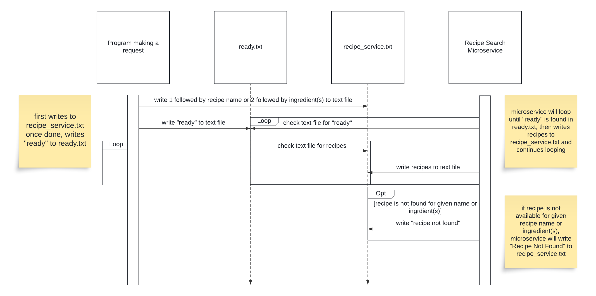

# Recipe Search Tool Microservice
## Description
A microservice that searches through a JSON file containing scraped recipes from [Epicurious](https://www.epicurious.com/). Data from the microservice is requested and received through text files. Recipes can be searched by using name or ingredient(s). The microservice will return up to 10 recipes that fit the search criteria in a text file.

This project was a collaborative assignment for OSU CS 361 (Software Engineering I). The project involved designing and implementing an individual project and a microservice that will be integrated into a partner's individual project.
## Getting Started
**REQUEST Data**

Data is requested through the use of two text files, ready.txt and recipe_service.txt. First, write "1" followed by a recipe name on a new line or "2" followed by ingredient(s) separated on a new line to recipe_service.txt. Once done writing to recipe_service.txt, write "ready" to ready.txt to request data.

Example call to search by recipe name:

```
1
chicken parmesan
```

Example call to search by ingredients:

```
2
chicken
tomato
mozzarella
spaghetti
```

_**NOTE:**_ Call is not case-sensitive

**RECEIVE Data**

Data is received through recipe_service.txt. Once data is requested, the microservice will search the JSON file for up to 10 recipes that fit the search criteria and write the recipe name, ingredients, and instructions to recipe_service.txt. Each recipe is separated by a number.

Example of data received:

```
1
Chicken Parmesan 
['2 cups fine dry breadcrumbs', '1 cup all-purpose flour', '4 large eggs', '1 cup whole milk', '8 small skinless, boneless chicken thighs, pounded to 1/2" thickness', 'Kosher salt, freshly ground pepper', 'N/A freshly ground pepper', '8 tablespoons olive oil', '8 tablespoons prepared sun-dried tomato pesto', '1 pound fresh mozzarella, cut into 8 slices', '1/2 teaspoon crushed red pepper flakes', '4 cups prepared marinara sauce, warmed', 'Finely grated Parmesan (for serving)']
Place breadcrumbs and flour in 2 separate shallow bowls. Whisk eggs and milk in a medium bowl. Season chicken with salt and pepper. Dredge in flour, shaking off excess. Coat with beaten egg mixture, allowing excess to drip back into bowl. Coat with breadcrumbs, pressing to adhere. Place on a large plate or rimmed baking sheet. Heat 2 tablespoons oil in a large skillet over medium heat. Working in 4 batches, cook thighs until chicken is golden brown and cooked through, about 4 minutes per side; transfer to a paper towel-lined plate. Wipe skillet clean and add 2 tablespoons oil between batches. Preheat broiler. Lay 4 cutlets on a foil-lined baking sheet; spread each with 2 tablespoons pesto, top with a slice of cheese, and sprinkle with red pepper. Top with remaining cutlets and cheese. Broil until cheese browns, about 4 minutes. Divide sauce and chicken among shallow bowls and top with Parmesan.
Place breadcrumbs and flour in 2 separate shallow bowls. Whisk eggs and milk in a medium bowl. Season chicken with salt and pepper. Dredge in flour, shaking off excess. Coat with beaten egg mixture, allowing excess to drip back into bowl. Coat with breadcrumbs, pressing to adhere. Place on a large plate or rimmed baking sheet.
Heat 2 tablespoons oil in a large skillet over medium heat. Working in 4 batches, cook thighs until chicken is golden brown and cooked through, about 4 minutes per side; transfer to a paper towel-lined plate. Wipe skillet clean and add 2 tablespoons oil between batches.
Preheat broiler. Lay 4 cutlets on a foil-lined baking sheet; spread each with 2 tablespoons pesto, top with a slice of cheese, and sprinkle with red pepper. Top with remaining cutlets and cheese. Broil until cheese browns, about 4 minutes.
Divide sauce and chicken among shallow bowls and top with Parmesan.
2
New Chicken Parmesan 
['1/3 cup extra-virgin olive oil', '2 large garlic cloves, pressed', '1/2 teaspoon salt', '1 12-ounce container grape tomatoes', '1 1/2 teaspoons dried oregano', 'Large pinch of dried crushed red pepper', '4 skinless boneless chicken breast halves (about 6 ounces each)', '1 1/4 cups finely grated Parmesan cheese, divided', '6 ounces fresh mozzarella cheese in water, drained, thinly sliced']
Preheat oven to 500° F. Whisk first 3 ingredients in large bowl. Place tomatoes in medium bowl; mix in 2 tablespoons garlic oil, then oregano and crushed red pepper. Add chicken to large bowl with remaining garlic oil and turn to coat. Place 1 cup Parmesan in pie dish. Dip 1 side of each chicken piece into cheese to coat; arrange chicken, cheese side up, on 1 half of large rimmed baking sheet. Scatter tomatoes on other half of sheet. Roast chicken until just cooked through and firm to touch, about 10 minutes. Arrange mozzarella slices atop chicken. Return to oven; roast until cheese melts, 1 to 2 minutes. Transfer chicken and tomatoes to 4 plates. Sprinkle with remaining 1/4 cup Parmesan cheese.
Preheat oven to 500° F. Whisk first 3 ingredients in large bowl. Place tomatoes in medium bowl; mix in 2 tablespoons garlic oil, then oregano and crushed red pepper. Add chicken to large bowl with remaining garlic oil and turn to coat.
Place 1 cup Parmesan in pie dish. Dip 1 side of each chicken piece into cheese to coat; arrange chicken, cheese side up, on 1 half of large rimmed baking sheet. Scatter tomatoes on other half of sheet.
Roast chicken until just cooked through and firm to touch, about 10 minutes. Arrange mozzarella slices atop chicken. Return to oven; roast until cheese melts, 1 to 2 minutes. Transfer chicken and tomatoes to 4 plates. Sprinkle with remaining 1/4 cup Parmesan cheese.
```
## UML Sequence Diagram

Below is the UML sequence diagram for the microservice:

